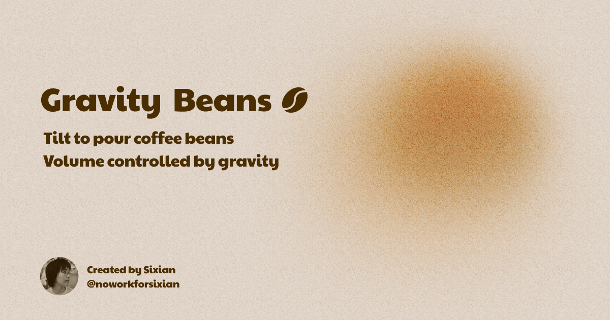

# Gravity Beans

Tilt to pour coffee beans. Volume controlled by gravity.

## Why

Inspired by [Physics Engine Volume Slider](https://www.reddit.com/r/ProgrammerHumor/comments/6fcbrb/physics_engine_volume_slider/). I thought integrating **real** gravity into it would be cool, so here you go.

## How it works

- Motion data: [ `devicemotion` ](https://developer.mozilla.org/en-US/docs/Web/API/Window/devicemotion_event)
- Sound: [Howler.js](https://howlerjs.com/)
- Gesture: [Framer Motion](https://www.framer.com/motion/)

Check out the [hooks](./src/hooks).

## License

This project is licensed under the MIT License.
